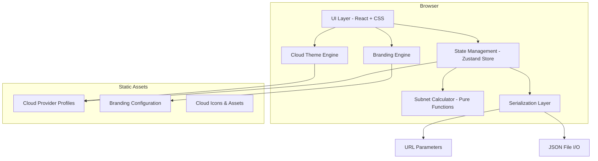
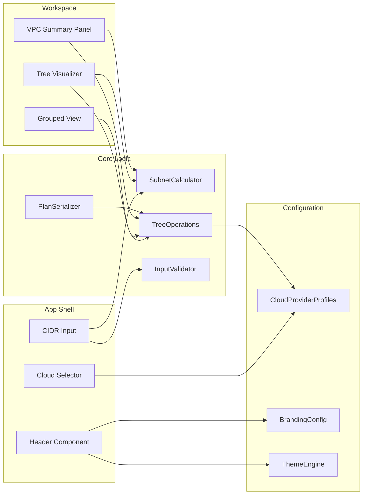
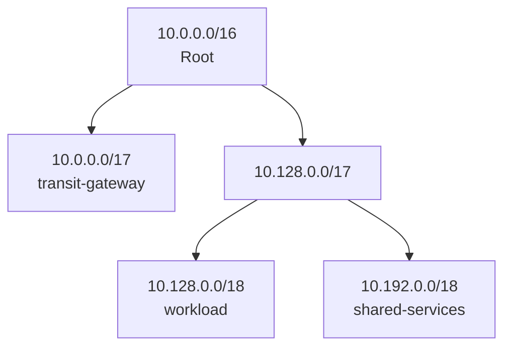

# Design Document: Cloud IPAM Web Application

## Overview

The Cloud IPAM Web Application is a client-side, offline-capable single-page application (SPA) for planning IP address allocation in cloud environments. It enables network engineers and cloud migration customers to visually design subnet hierarchies, tag subnets with cloud-specific use cases, and generate VPC planning summaries — all without server-side computation or data transmission.

The application runs entirely in the browser after initial load. It supports four target cloud platforms (AWS, Azure, GCP, Private Cloud), each with distinct reserved-IP rules, subnet limits, and use-case tag vocabularies. The first brand deployment is Rackspace, with white-labelling support for other platform owners.

**Key Design Decisions:**
- Pure client-side architecture: all IP arithmetic, state management, and rendering happen in-browser
- URL-based state persistence for shareability; JSON file export/import for portability
- Tree-based data model for subnet hierarchy with O(1) split/join operations
- Cloud provider profiles as static configuration objects loaded at selection time
- Branding and theming as layered configuration: white-label brand colors → cloud accent colors → tag colors

## Architecture

### High-Level Architecture



### Technology Stack

| Layer | Technology | Rationale |
|-------|-----------|-----------|
| UI Framework | React 18+ with TypeScript | Component-based, strong typing, large ecosystem |
| State Management | Zustand | Lightweight, no boilerplate, supports middleware for URL sync |
| Styling | CSS Modules + CSS Custom Properties | Scoped styles with runtime theming via custom properties |
| Build Tool | Vite | Fast HMR, tree-shaking, PWA plugin support |
| Offline Support | Service Worker (vite-plugin-pwa) | Cache-first strategy for offline capability |
| Testing | Vitest + fast-check | Fast unit tests with property-based testing support |
| IP Arithmetic | Custom pure-function module | No external dependency needed for IPv4 CIDR math |

### Architectural Principles

1. **Zero network dependency post-load**: No API calls, no telemetry, no CDN fonts at runtime
2. **Immutable state transitions**: Every split/join/tag operation produces a new state snapshot
3. **Separation of concerns**: Calculator logic is pure functions independent of UI framework
4. **Configuration-driven theming**: Brand and cloud themes are data, not code
5. **URL as persistence layer**: The full network plan is encodable in a shareable URL

## Components and Interfaces

### Component Diagram



### Core Interfaces

```typescript
// === IP Arithmetic ===

interface IPv4Address {
  /** 32-bit unsigned integer representation */
  readonly bits: number;
}

interface CIDRBlock {
  readonly networkAddress: IPv4Address;
  readonly prefixLength: number; // 8–30
}

interface SubnetInfo {
  readonly cidr: CIDRBlock;
  readonly networkAddress: string;    // dotted-decimal
  readonly broadcastAddress: string;  // dotted-decimal
  readonly subnetMask: string;        // dotted-decimal
  readonly totalAddresses: number;
  readonly usableHosts: number;       // after provider reservations
  readonly reservedCount: number;
}

// === Subnet Tree ===

interface SubnetNode {
  readonly id: string;               // unique identifier
  readonly cidr: CIDRBlock;
  readonly children: [SubnetNode, SubnetNode] | null; // null = leaf
  readonly tags: UseCaseTag[];       // 0–5 tags, leaf only
  readonly workloadAccount: string | null;  // 1–64 chars
  readonly availabilityZone: string | null; // up to 64 chars
  readonly label: string | null;     // 1–64 chars
}

type UseCaseTag = {
  readonly id: string;
  readonly name: string;             // 1–32 chars
  readonly isCustom: boolean;
  readonly color: string;            // hex color
};

// === Cloud Provider Profile ===

interface CloudProviderProfile {
  readonly cloudId: TargetCloud;
  readonly displayName: string;
  readonly reservedIPs: number;      // per subnet
  readonly reservedReasons: string[];
  readonly subnetLimit: number;      // max subnets per VPC/VNet
  readonly defaultTags: UseCaseTag[];
  readonly accentColor: string;      // hex
  readonly iconPath: string;
}

type TargetCloud = 'aws' | 'azure' | 'gcp' | 'private';

// === Network Plan (Serializable State) ===

interface NetworkPlan {
  readonly version: number;          // schema version for forward compat
  readonly targetCloud: TargetCloud;
  readonly rootCIDR: CIDRBlock;
  readonly tree: SubnetNode;
  readonly customTags: UseCaseTag[];
  readonly privateCloudReservedCount?: number; // 2–10, private cloud only
  readonly privateCloudIcon?: string; // data URI or null
}

// === Branding ===

interface BrandingConfiguration {
  readonly logoUrl: string | null;
  readonly primaryColor: string;     // hex
  readonly secondaryColor: string;   // hex
  readonly title: string;            // up to 64 chars
  readonly faviconUrl: string | null;
}

// === Serialization ===

interface PlanSerializer {
  toURL(plan: NetworkPlan): string;
  fromURL(url: string): NetworkPlan | SerializationError;
  toJSON(plan: NetworkPlan): string;
  fromJSON(json: string): NetworkPlan | SerializationError;
}

interface SerializationError {
  readonly type: 'invalid_format' | 'invalid_data' | 'size_exceeded';
  readonly message: string;
  readonly details?: string;
}

// === Subnet Calculator ===

interface SubnetCalculatorAPI {
  computeSubnetInfo(cidr: CIDRBlock, reservedCount: number): SubnetInfo;
  split(node: SubnetNode): [SubnetNode, SubnetNode] | SplitError;
  canSplit(node: SubnetNode): boolean;
  join(parent: SubnetNode): SubnetNode | JoinError;
  canJoin(parent: SubnetNode): boolean;
  adjustToNetworkAddress(ip: IPv4Address, prefix: number): CIDRBlock;
}

type SplitError = { type: 'max_depth'; message: string };
type JoinError = { type: 'not_leaf_children' | 'has_assignments'; message: string };

// === Summary ===

interface VPCSummary {
  readonly totalSubnets: number;
  readonly subnetsByTag: Map<string, number>;
  readonly subnetsByAZ: Map<string, number>;
  readonly totalUsableIPs: number;
  readonly allocationPercentage: number;  // 0–100, 1 decimal
  readonly accountBreakdown: AccountAllocation[];
  readonly limitWarning: LimitWarning | null;
}

interface AccountAllocation {
  readonly account: string;
  readonly subnetCount: number;
  readonly usableIPs: number;
  readonly percentageOfTotal: number;
}

interface LimitWarning {
  readonly currentCount: number;
  readonly maxAllowed: number;
  readonly providerName: string;
}
```

### Key Module Responsibilities

| Module | Responsibility |
|--------|---------------|
| `SubnetCalculator` | Pure IP arithmetic: network/broadcast/mask computation, host counting with reservations |
| `TreeOperations` | Split/join logic, tree traversal, leaf enumeration, tag management |
| `InputValidator` | CIDR format validation, tag name validation, branding config validation |
| `PlanSerializer` | Encode/decode NetworkPlan to/from URL params and JSON |
| `ThemeEngine` | Apply CSS custom properties based on active cloud + brand config |
| `CloudProviderProfiles` | Static data: reserved IPs, limits, default tags per cloud |

## Data Models

### Subnet Tree Structure

The subnet hierarchy is modeled as a binary tree where each split produces exactly two children. This maps directly to CIDR subdivision (splitting a /N produces two /N+1 networks).



**Tree Invariants:**
- Every non-leaf node has exactly 2 children
- Children's prefix length = parent's prefix length + 1
- First child's network address = parent's network address
- Second child's network address = parent's network address + 2^(32 - child prefix)
- Tags, workload accounts, AZ assignments, and labels exist only on leaf nodes
- Maximum tree depth: 22 levels (/8 root to /30 leaves)

### Cloud Provider Profiles (Static Data)

```typescript
const AWS_PROFILE: CloudProviderProfile = {
  cloudId: 'aws',
  displayName: 'Amazon Web Services',
  reservedIPs: 5,
  reservedReasons: ['Network address', 'VPC router', 'DNS server', 'Future use', 'Broadcast'],
  subnetLimit: 200,
  defaultTags: [
    { id: 'aws-tgw', name: 'transit-gateway', isCustom: false, color: '#FF9900' },
    { id: 'aws-insp', name: 'inspection', isCustom: false, color: '#D13212' },
    { id: 'aws-vpn', name: 'vpn-routing', isCustom: false, color: '#1B660F' },
    { id: 'aws-wl', name: 'workload', isCustom: false, color: '#2E73B8' },
    { id: 'aws-ss', name: 'shared-services', isCustom: false, color: '#8C4FFF' },
    { id: 'aws-eg', name: 'egress', isCustom: false, color: '#E07941' },
  ],
  accentColor: '#FF9900',
  iconPath: '/icons/aws.svg',
};

const AZURE_PROFILE: CloudProviderProfile = {
  cloudId: 'azure',
  displayName: 'Microsoft Azure',
  reservedIPs: 5,
  reservedReasons: ['Network address', 'Default gateway', 'Azure DNS (primary)', 'Azure DNS (secondary)', 'Broadcast'],
  subnetLimit: 3000,
  defaultTags: [
    { id: 'az-hub', name: 'hub-vnet', isCustom: false, color: '#0078D4' },
    { id: 'az-spoke', name: 'spoke-vnet', isCustom: false, color: '#50E6FF' },
    { id: 'az-vpn', name: 'vpn-gateway', isCustom: false, color: '#773ADC' },
    { id: 'az-fw', name: 'firewall', isCustom: false, color: '#E3008C' },
    { id: 'az-wl', name: 'workload', isCustom: false, color: '#00B7C3' },
    { id: 'az-ss', name: 'shared-services', isCustom: false, color: '#FFB900' },
  ],
  accentColor: '#0078D4',
  iconPath: '/icons/azure.svg',
};

const GCP_PROFILE: CloudProviderProfile = {
  cloudId: 'gcp',
  displayName: 'Google Cloud Platform',
  reservedIPs: 4,
  reservedReasons: ['Network address', 'Default gateway', 'Reserved (second-to-last)', 'Broadcast'],
  subnetLimit: 300,
  defaultTags: [
    { id: 'gcp-host', name: 'shared-vpc-host', isCustom: false, color: '#4285F4' },
    { id: 'gcp-svc', name: 'shared-vpc-service', isCustom: false, color: '#34A853' },
    { id: 'gcp-ic', name: 'interconnect', isCustom: false, color: '#FBBC04' },
    { id: 'gcp-wl', name: 'workload', isCustom: false, color: '#EA4335' },
    { id: 'gcp-ss', name: 'shared-services', isCustom: false, color: '#A142F4' },
  ],
  accentColor: '#4285F4',
  iconPath: '/icons/gcp.svg',
};

const PRIVATE_PROFILE: CloudProviderProfile = {
  cloudId: 'private',
  displayName: 'Private Cloud',
  reservedIPs: 2, // configurable 2–10
  reservedReasons: ['Network address', 'Broadcast'],
  subnetLimit: Infinity, // no provider limit
  defaultTags: [
    { id: 'priv-core', name: 'core-network', isCustom: false, color: '#6B7280' },
    { id: 'priv-dmz', name: 'dmz', isCustom: false, color: '#EF4444' },
    { id: 'priv-wl', name: 'workload', isCustom: false, color: '#3B82F6' },
    { id: 'priv-mgmt', name: 'management', isCustom: false, color: '#10B981' },
  ],
  accentColor: '#6B7280',
  iconPath: '/icons/private-cloud.svg',
};
```

### Network Plan JSON Schema

```json
{
  "$schema": "http://json-schema.org/draft-07/schema#",
  "type": "object",
  "required": ["version", "targetCloud", "rootCIDR", "tree"],
  "properties": {
    "version": { "type": "integer", "const": 1 },
    "targetCloud": { "enum": ["aws", "azure", "gcp", "private"] },
    "rootCIDR": { "type": "string", "pattern": "^\\d{1,3}\\.\\d{1,3}\\.\\d{1,3}\\.\\d{1,3}/\\d{1,2}$" },
    "tree": { "$ref": "#/definitions/SubnetNode" },
    "customTags": {
      "type": "array",
      "maxItems": 20,
      "items": { "$ref": "#/definitions/Tag" }
    },
    "privateCloudReservedCount": { "type": "integer", "minimum": 2, "maximum": 10 }
  },
  "definitions": {
    "SubnetNode": {
      "type": "object",
      "required": ["id", "cidr"],
      "properties": {
        "id": { "type": "string" },
        "cidr": { "type": "string" },
        "children": {
          "oneOf": [
            { "type": "null" },
            { "type": "array", "items": { "$ref": "#/definitions/SubnetNode" }, "minItems": 2, "maxItems": 2 }
          ]
        },
        "tags": { "type": "array", "maxItems": 5, "items": { "type": "string" } },
        "workloadAccount": { "type": ["string", "null"], "maxLength": 64 },
        "availabilityZone": { "type": ["string", "null"], "maxLength": 64 },
        "label": { "type": ["string", "null"], "maxLength": 64 }
      }
    },
    "Tag": {
      "type": "object",
      "required": ["id", "name"],
      "properties": {
        "id": { "type": "string" },
        "name": { "type": "string", "minLength": 1, "maxLength": 32 },
        "color": { "type": "string", "pattern": "^#[0-9A-Fa-f]{6}$" }
      }
    }
  }
}
```

### URL Encoding Strategy

The Network Plan is encoded into URL hash parameters using a compact binary-like encoding to keep URLs shareable:

1. **Root CIDR**: Stored as `c=<ip>/<prefix>` (e.g., `c=10.0.0.0/16`)
2. **Target Cloud**: Stored as `t=<aws|azure|gcp|private>`
3. **Tree Structure**: Encoded as a bit string where `1` = split, `0` = leaf, traversed depth-first left-to-right. Base64-encoded as `s=<base64>`
4. **Tags/Assignments**: Encoded as a comma-separated list of `nodeIndex:tagId:account:az:label` tuples, Base64-encoded as `d=<base64>`
5. **Custom Tags**: Encoded as `ct=<base64(name1:color1,name2:color2,...)>`
6. **Private Cloud Reserved Count**: `r=<2-10>` (only when target is private)

Example: `#c=10.0.0.0/16&t=aws&s=AQEBAA&d=Mzp0Z3c6YWNjdDE6dXMtZWFzdC0xYTpUcmFuc2l0`

### State Management

```typescript
interface AppState {
  // Core state
  targetCloud: TargetCloud | null;
  networkPlan: NetworkPlan | null;
  
  // Derived (computed from networkPlan)
  summary: VPCSummary | null;
  
  // UI state
  expandedNodes: Set<string>;
  activeView: 'tree' | 'grouped';
  
  // Configuration
  branding: BrandingConfiguration;
  providerProfile: CloudProviderProfile | null;
  
  // Actions
  selectCloud(cloud: TargetCloud): void;
  setRootCIDR(input: string): ValidationResult;
  splitSubnet(nodeId: string): void;
  joinSubnet(parentId: string): void;
  assignTag(nodeId: string, tag: UseCaseTag): void;
  removeTag(nodeId: string, tagId: string): void;
  setWorkloadAccount(nodeId: string, account: string | null): void;
  setAvailabilityZone(nodeId: string, az: string | null): void;
  setLabel(nodeId: string, label: string | null): void;
  exportJSON(): string;
  importJSON(json: string): ImportResult;
  syncToURL(): void;
  loadFromURL(): void;
}
```

## Correctness Properties

*A property is a characteristic or behavior that should hold true across all valid executions of a system — essentially, a formal statement about what the system should do. Properties serve as the bridge between human-readable specifications and machine-verifiable correctness guarantees.*

### Property 1: Operations require cloud selection

*For any* subnet operation (split, join, tag assignment, workload assignment), if no Target_Cloud has been selected, the operation SHALL be rejected and the state SHALL remain unchanged.

**Validates: Requirements 1.1**

### Property 2: Cloud change preserves tag intersection

*For any* set of tagged subnets and any two cloud profiles (old and new), after switching from old to new Target_Cloud, the remaining tags on each subnet SHALL equal the intersection of the subnet's previous tags and the new profile's available tag set.

**Validates: Requirements 1.7**

### Property 3: CIDR input validation correctness

*For any* input string, the CIDR validator SHALL accept it if and only if it matches the format of four decimal octets (each 0–255) separated by dots, followed by a forward slash and a numeric prefix length between 8 and 30 inclusive. All other strings SHALL be rejected with an appropriate error classification.

**Validates: Requirements 2.3, 2.4, 2.6**

### Property 4: Subnet arithmetic correctness

*For any* valid CIDR block with prefix length P, the SubnetCalculator SHALL compute: network address with all host bits zeroed, broadcast address with all host bits set, subnet mask with P leading 1-bits, and total addresses equal to 2^(32-P).

**Validates: Requirements 2.2**

### Property 5: Host-bit auto-adjustment

*For any* IPv4 address and prefix length P (8–30), adjustToNetworkAddress SHALL produce an address where all (32-P) host bits are zero, and the resulting network address bitwise-ANDed with the subnet mask equals itself.

**Validates: Requirements 2.5**

### Property 6: Split produces valid binary subdivision

*For any* leaf subnet node with prefix length P < 30, splitting SHALL produce exactly two children where: each child has prefix P+1, the first child's network address equals the parent's network address, the second child's network address equals the parent's network address plus 2^(32-(P+1)), and the two children's address ranges are non-overlapping and together cover the parent's full range.

**Validates: Requirements 3.1, 3.4**

### Property 7: Split eligibility invariant

*For any* node in the subnet tree, canSplit SHALL return true if and only if the node is a leaf (children === null) AND the node's prefix length is strictly less than 30.

**Validates: Requirements 3.3, 3.6**

### Property 8: Split-then-join round trip

*For any* leaf subnet node with prefix < 30 and no tag/account/AZ/label assignments, splitting and then immediately joining SHALL restore the original node with identical CIDR, null children, and no assignments.

**Validates: Requirements 4.1**

### Property 9: Join eligibility invariant

*For any* node in the subnet tree, canJoin SHALL return true if and only if the node has exactly two children and both children are leaf nodes (each child's children === null).

**Validates: Requirements 4.2**

### Property 10: Usable host calculation with provider reservations

*For any* valid subnet with prefix length P and any cloud provider profile with reserved count R, the computed usable host count SHALL equal max(0, 2^(32-P) - R).

**Validates: Requirements 5.1, 5.2, 5.3, 5.4, 5.6**

### Property 11: Tag assignment constraints on leaf subnets

*For any* leaf subnet, assigning tags SHALL succeed for 1 to 5 tags and SHALL reject the assignment when attempting to add a 6th tag. *For any* non-leaf subnet, tag assignment SHALL always be rejected.

**Validates: Requirements 6.1, 6.9**

### Property 12: Custom tag name validation

*For any* string, it SHALL be accepted as a custom tag name if and only if its length is between 1 and 32 characters inclusive. The system SHALL accept up to 20 custom tags and reject any addition beyond that count.

**Validates: Requirements 1.6, 6.6**

### Property 13: Text field length validation

*For any* string intended as a workload account identifier, availability zone identifier, or text label, it SHALL be accepted if and only if its length is between 1 and 64 characters inclusive.

**Validates: Requirements 6.3, 6.4, 6.7**

### Property 14: Tag color uniqueness

*For any* cloud provider profile (including custom tags), all Use_Case_Tags in the available set SHALL have distinct color values — no two tags share the same hex color.

**Validates: Requirements 6.5**

### Property 15: Available tags equal profile defaults plus custom

*For any* Target_Cloud selection, the set of available Use_Case_Tags SHALL equal the union of the selected cloud profile's default tags and the user-defined custom tags.

**Validates: Requirements 6.2**

### Property 16: Grouped view partitions tagged leaves correctly

*For any* subnet tree with tagged leaves, the grouped view SHALL contain every tagged leaf subnet exactly once per assigned tag, and each group SHALL contain only subnets that have that group's tag assigned.

**Validates: Requirements 7.5**

### Property 17: URL serialization round trip

*For any* valid NetworkPlan (including root CIDR, target cloud, all splits, tags, workload accounts, availability zones, labels, and custom tags), encoding to URL parameters and then decoding SHALL produce a NetworkPlan equivalent to the original.

**Validates: Requirements 8.1, 8.2, 8.9**

### Property 18: JSON serialization round trip

*For any* valid NetworkPlan, exporting to JSON and then importing SHALL produce a NetworkPlan equivalent to the original.

**Validates: Requirements 8.4, 8.9**

### Property 19: Invalid serialized input produces error

*For any* string that is not a valid encoded NetworkPlan (malformed URL parameters or invalid JSON), deserialization SHALL return a SerializationError and SHALL not produce a valid NetworkPlan.

**Validates: Requirements 8.3, 8.6**

### Property 20: Summary subnet count correctness

*For any* subnet tree, the summary's totalSubnets SHALL equal the count of leaf nodes in the tree, subnetsByTag counts SHALL equal the actual number of leaves with each tag, and subnetsByAZ counts SHALL equal the actual number of leaves assigned to each availability zone.

**Validates: Requirements 10.1**

### Property 21: Summary usable IP total correctness

*For any* subnet tree and active cloud provider profile, the summary's totalUsableIPs SHALL equal the sum of max(0, 2^(32-leaf.prefix) - reservedCount) across all leaf subnets.

**Validates: Requirements 10.4**

### Property 22: Summary provider limit warning

*For any* subnet tree and cloud provider profile, a limit warning SHALL be produced if and only if the count of leaf subnets exceeds the profile's subnetLimit, and the warning SHALL contain the correct current count and maximum allowed.

**Validates: Requirements 10.2**

### Property 23: Summary workload account breakdown

*For any* subnet tree with workload account assignments, the account breakdown SHALL correctly partition leaves by account, and each account's usableIPs SHALL equal the sum of usable hosts for its assigned leaves.

**Validates: Requirements 10.5**

### Property 24: Allocation percentage correctness

*For any* subnet tree, the allocation percentage SHALL equal (sum of leaf subnet total addresses / root subnet total addresses) × 100, rounded to one decimal place.

**Validates: Requirements 10.3**

### Property 25: Branding fallback for invalid configuration

*For any* BrandingConfiguration where one or more fields contain invalid values (malformed hex color, title exceeding 64 characters, unsupported image format), the system SHALL use the Rackspace default value for each invalid field while applying valid fields normally.

**Validates: Requirements 11.8**

### Property 26: Cloud accent colors do not override brand colors

*For any* combination of BrandingConfiguration and Target_Cloud selection, the application header background and primary action buttons SHALL use the brand primary color (not the cloud accent color), and cloud accent colors SHALL only be applied to cloud-context elements (provider icon backgrounds, tag color coding, subnet visualization borders).

**Validates: Requirements 12.6**

## Error Handling

### Input Validation Errors

| Error Condition | User Feedback | Recovery |
|----------------|---------------|----------|
| Malformed CIDR (bad format) | Inline error below input: "Invalid format. Enter as X.X.X.X/N" | Input remains editable, previous state unchanged |
| Octet out of range (>255) | Inline error: "Octet value must be 0–255" | Same |
| Prefix out of range | Inline error: "Prefix must be between /8 and /30" | Same |
| Host bits set | Inline notification: "Adjusted to network address: X.X.X.X/N" | Auto-corrects and proceeds |
| Split at /30 | Split button disabled, tooltip: "Maximum split depth reached" | No action available |
| Join with assignments | Confirmation dialog listing what will be lost | Cancel returns to previous state |
| Tag on non-leaf | Inline message: "Only leaf subnets can be tagged" | Action prevented |
| 6th tag assignment | Inline message: "Maximum 5 tags per subnet" | Action prevented |
| Custom tag name too long | Inline error: "Tag name must be 1–32 characters" | Input remains editable |
| 21st custom tag | Inline error: "Maximum 20 custom tags allowed" | Action prevented |

### Serialization Errors

| Error Condition | User Feedback | Recovery |
|----------------|---------------|----------|
| Invalid URL parameters | Toast notification: "Could not load plan from URL: [reason]" | App loads with empty default state |
| Invalid JSON import | Modal error: "Import failed: [validation details]" | Current plan retained unchanged |
| JSON file >5MB | Modal error: "File exceeds 5 MB size limit" | Current plan retained unchanged |
| Corrupt tree structure in import | Modal error: "Invalid network plan structure" | Current plan retained unchanged |

### Cloud Selection Errors

| Error Condition | User Feedback | Recovery |
|----------------|---------------|----------|
| Cloud change with incompatible tags | Confirmation dialog listing affected tags | Cancel preserves current state |
| Profile load failure (corrupt static data) | Console error + fallback to Private Cloud profile | App remains functional |

### Branding Configuration Errors

| Error Condition | User Feedback | Recovery |
|----------------|---------------|----------|
| Invalid hex color in config | Console warning: "Invalid brand color, using default" | Rackspace default for that field |
| Logo URL unreachable | Console warning: "Logo failed to load" | Rackspace logo displayed |
| Title >64 chars | Console warning: "Title exceeds 64 chars, using default" | Rackspace title used |
| Unsupported image format | Console warning: "Unsupported format, using default" | Rackspace default for that asset |

## Additional Components (Post-Initial Design)

### CIDR Suffix Dropdown (Requirement 13)

A custom dropdown adjacent to the CIDR text input that offers prefix lengths /8 to /28. The trigger button shows only the mask (e.g., `/16`); the expanded list shows prefix + total address count. Bidirectional sync: typing a CIDR updates the dropdown selection; selecting from the dropdown updates the text input prefix.

### Reverse CIDR Calculator (Requirement 14)

A pure-function module (`src/core/reverse-cidr-calculator.ts`) that determines the smallest prefix providing at least N usable IPs after provider reservations. Used by the "Create Workload" dialog to suggest subnet allocations. Includes tree-search logic to find available space and calculate required split operations.

```typescript
interface ReverseCIDRResult {
  suggestedPrefix: number;
  totalAddresses: number;
  usableAddresses: number;
  surplus: number;
}

function calculateReverseCIDR(requestedUsableIPs: number, reservedCount: number): ReverseCIDRResult | ReverseCIDRError;
function findAvailableLeaf(tree: SubnetNode, targetPrefix: number): string | null;
```

### Internationalization / Language Toggle (Requirement 15)

Lightweight i18n system using a Zustand store (`src/i18n/`):

- `translations.ts` — typed EN/DE dictionaries covering all UI strings
- `i18n-store.ts` — exposes `language`, `t` (current translations), and `setLanguage()`
- Language toggle (EN | DE) rendered in the header below the Rackspace logo
- Title always stays English; all other UI text switches instantly on toggle
- Components consume translations via `useI18n()` hook: `const { t } = useI18n()`

## Testing Strategy

### Testing Approach

This project uses a dual testing strategy combining property-based tests for universal correctness guarantees with example-based unit tests for specific scenarios and edge cases.

### Property-Based Testing

**Library**: fast-check (TypeScript)
**Minimum iterations**: 100 per property test
**Tag format**: `Feature: cloud-ipam-webapp, Property {N}: {title}`

Property-based tests target the pure-function core:
- `SubnetCalculator` — IP arithmetic, usable host computation
- `TreeOperations` — split/join structural invariants, round-trip properties
- `InputValidator` — CIDR validation, text field validation, tag name validation
- `PlanSerializer` — URL and JSON round-trip serialization
- `SummaryCalculator` — counting, aggregation, percentage computation
- `ThemeEngine` — color layering rules, tag color uniqueness

Each correctness property (1–26) maps to one property-based test. Generators will produce:
- Random valid CIDR blocks (prefix 8–30, valid octets)
- Random subnet trees (sequences of split operations from a root)
- Random tag assignments (1–5 tags from available set)
- Random workload/AZ/label strings (valid and invalid lengths)
- Random NetworkPlans (combining all of the above)
- Random invalid inputs (malformed CIDRs, corrupt JSON, oversized files)

### Unit Tests (Example-Based)

Unit tests cover:
- Cloud provider profile data correctness (specific tag lists per cloud)
- Default branding values (Rackspace defaults)
- Specific UI behaviors (confirmation dialogs, disabled states)
- Edge cases: /30 split disabled, subnet too small for provider, empty tree summary
- Integration between components (cloud selection triggers profile load)

### Integration Tests

- Service worker caching and offline operation
- URL state persistence across page reloads
- JSON file import/export via File API
- Branding configuration loading from JSON file
- Cloud theme transitions (CSS custom property updates)

### Accessibility Testing

- Keyboard navigation through tree nodes and controls
- Screen reader announcements for split/join operations
- Color contrast verification for all theme combinations
- Focus management after state changes
- ARIA labels on interactive elements

### Performance Benchmarks

- Split/join operations: < 100ms for trees up to 500 leaves
- Summary recalculation: < 200ms for 500-leaf trees
- Initial profile load: < 1 second
- Theme transition: < 300ms

