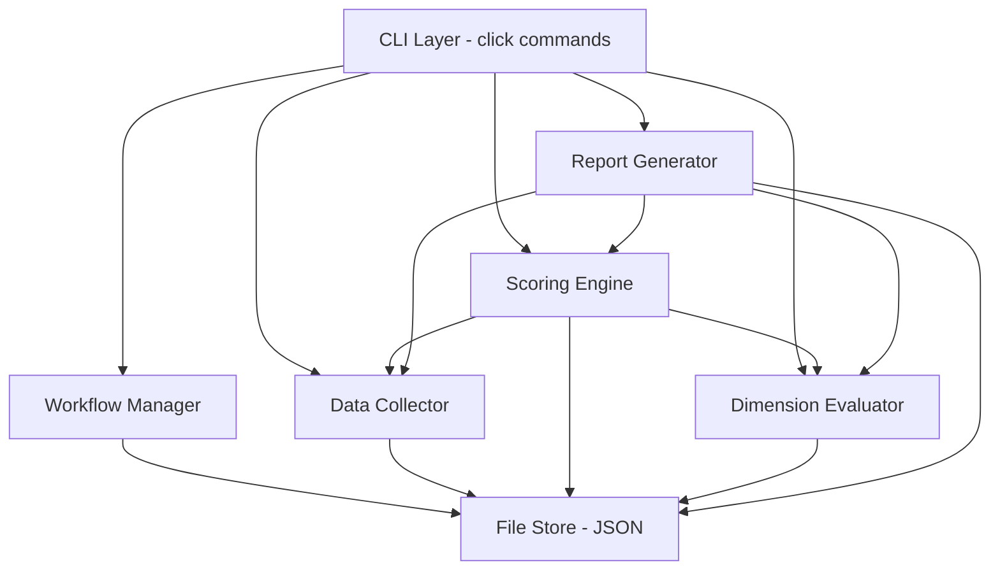

# Design Document: DMG Hyperscaler Report

## Overview

This system provides a Python-based CLI tool and library for producing a hyperscaler recommendation report for DMG Media's Cloud Readiness Assessment (CRA) Phase 1. It compares AWS, Azure, and GCP across five weighted decision dimensions (Economics, Security/Compliance, Scalability, Reliability, Business Agility), ingests infrastructure discovery data, manages evidence, and generates both a Word document report and a PowerPoint executive summary.

The system is designed as a local, single-user tool run by a Lead Architect. There is no web UI, database server, or multi-user concurrency requirement. All state is persisted to local JSON files.

### Key Design Decisions

1. **Python 3.11+** — rich ecosystem for document generation (`python-docx`, `python-pptx`), data handling (`pandas`), and charting (`matplotlib`).
2. **CLI interface via `click`** — simple, composable commands for each workflow step.
3. **Local JSON file persistence** — no database needed; the dataset is small and single-user.
4. **Pydantic v2 for data models** — validation, serialization, and schema enforcement.
5. **`python-docx` for Word generation** — mature, well-supported library for `.docx` creation.
6. **`python-pptx` for PowerPoint generation** — mature library for `.pptx` creation with chart support.
7. **`matplotlib` for charts** — radar/bar charts embedded as images in PowerPoint slides.

## Architecture

The system follows a layered architecture with clear separation between data, logic, and output concerns.



### Layer Responsibilities

- **CLI Layer**: Parses user commands, validates arguments, delegates to core components.
- **Workflow Manager**: Tracks completion status of each workflow step, calculates overall progress, enforces step prerequisites.
- **Data Collector**: Ingests CSV/JSON infrastructure data and hyperscaler proposal data, validates, aggregates.
- **Scoring Engine**: Manages dimension/sub-factor weights, calculates weighted scores, generates the decision matrix, handles rankings and ties.
- **Dimension Evaluator**: Manages evidence entries, links evidence to sub-factor scores.
- **Report Generator**: Produces Word (.docx) and PowerPoint (.pptx) documents from scored data.
- **File Store**: Simple JSON file read/write for all persistent state.

## Components and Interfaces

### 1. CLI Layer (`cli.py`)

```python
# Commands exposed via click
init()                          # Initialize a new assessment project with default framework
import_infra(file_path)         # Import infrastructure CSV/JSON
import_proposal(provider, file) # Import hyperscaler proposal data
set_weights(dimension, weights) # Set dimension or sub-factor weights
score(provider, sub_factor, score, evidence)  # Score a hyperscaler on a sub-factor
add_evidence(title, description, source, provider)  # Create evidence entry
link_evidence(evidence_id, provider, sub_factor)     # Link evidence to a score
status()                        # Show workflow progress
generate_report(output_path)    # Generate Word document
generate_summary(output_path)   # Generate PowerPoint executive summary
show_matrix()                   # Display decision matrix in terminal
```

### 2. Data Collector (`data_collector.py`)

```python
class DataCollector:
    def import_infrastructure(self, file_path: str) -> ImportResult
    def import_proposal(self, provider: str, data: HyperscalerProposal) -> None
    def add_proposal_notes(self, provider: str, notes: str) -> None
    def get_infrastructure_summary(self) -> InfrastructureSummary
    def get_proposal(self, provider: str) -> HyperscalerProposal
    def get_all_proposals(self) -> dict[str, HyperscalerProposal]
```

### 3. Scoring Engine (`scoring_engine.py`)

```python
class ScoringEngine:
    def set_dimension_weights(self, weights: dict[str, float]) -> None
    def set_sub_factor_weights(self, dimension: str, weights: dict[str, float]) -> None
    def get_dimension_weights(self) -> dict[str, float]
    def get_sub_factor_weights(self, dimension: str) -> dict[str, float]
    def set_score(self, provider: str, sub_factor: str, score: int, evidence_ids: list[str]) -> None
    def get_weighted_sub_factor_score(self, provider: str, sub_factor: str) -> float
    def get_weighted_dimension_score(self, provider: str, dimension: str) -> float
    def get_overall_score(self, provider: str) -> float
    def generate_decision_matrix(self) -> DecisionMatrix
    def get_unscored_sub_factors(self, provider: str) -> list[str]
```

### 4. Dimension Evaluator (`dimension_evaluator.py`)

```python
class DimensionEvaluator:
    def create_evidence(self, title: str, description: str, source: str, provider: str) -> Evidence
    def edit_evidence(self, evidence_id: str, **updates) -> Evidence
    def remove_evidence(self, evidence_id: str) -> None
    def link_evidence(self, evidence_id: str, provider: str, sub_factor: str) -> None
    def unlink_evidence(self, evidence_id: str, provider: str, sub_factor: str) -> None
    def get_evidence_for_score(self, provider: str, sub_factor: str) -> list[Evidence]
    def get_all_evidence(self) -> list[Evidence]
```

### 5. Report Generator (`report_generator.py`)

```python
class ReportGenerator:
    def generate_word_report(self, output_path: str) -> str
    def generate_powerpoint_summary(self, output_path: str) -> str
```

### 6. Workflow Manager (`workflow_manager.py`)

```python
class WorkflowManager:
    def get_status(self) -> WorkflowStatus
    def get_completion_percentage(self) -> float
    def is_step_complete(self, step: str) -> bool
    def can_generate_report(self) -> tuple[bool, list[str]]
    def mark_step_complete(self, step: str) -> None
```

### 7. File Store (`file_store.py`)

```python
class FileStore:
    def __init__(self, project_dir: str)
    def load(self, key: str) -> dict
    def save(self, key: str, data: dict) -> None
    def exists(self, key: str) -> bool
```

All components receive a `FileStore` instance at construction time, keeping I/O isolated and testable.

## Data Models

All models use Pydantic v2 for validation and serialization.

```python
from pydantic import BaseModel, Field
from enum import Enum
from uuid import uuid4

class Provider(str, Enum):
    AWS = "AWS"
    AZURE = "Azure"
    GCP = "GCP"

class DimensionName(str, Enum):
    ECONOMICS = "Economics"
    SECURITY_RISK_AND_COMPLIANCE = "Security_Risk_and_Compliance"
    SCALABILITY = "Scalability"
    RELIABILITY = "Reliability"
    BUSINESS_AGILITY = "Business_Agility"

class SubFactor(BaseModel):
    name: str
    weight: float = Field(ge=0, le=100, default=0)

class DecisionDimension(BaseModel):
    name: DimensionName
    weight: float = Field(ge=0, le=100, default=0)
    sub_factors: list[SubFactor]

class Evidence(BaseModel):
    id: str = Field(default_factory=lambda: str(uuid4()))
    title: str
    description: str
    source: str
    provider: Provider

class SubFactorScore(BaseModel):
    provider: Provider
    sub_factor: str
    dimension: DimensionName
    raw_score: int = Field(ge=1, le=5)
    evidence_ids: list[str] = Field(min_length=1)

class InfrastructureRecord(BaseModel):
    server_name: str
    data_centre: str
    operating_system: str
    # Additional optional fields
    application: str | None = None
    database_type: str | None = None
    data_volume_gb: float | None = None

class InfrastructureSummary(BaseModel):
    total_servers: int
    total_applications: int
    total_databases: int
    total_data_volume_tb: float
    servers_per_data_centre: dict[str, int]

class HyperscalerProposal(BaseModel):
    provider: Provider
    proposed_pricing: str
    migration_approach: str
    partnership_model: str
    training_offerings: str
    key_differentiators: str
    notes: str = ""

class ImportResult(BaseModel):
    records_imported: int
    validation_errors: list[str]

class DimensionRanking(BaseModel):
    dimension: DimensionName
    rankings: dict[str, int]  # provider -> rank (1, 2, 3)
    scores: dict[str, float]  # provider -> weighted score
    leader: str | None  # provider name, None if tied
    is_tied: bool = False

class DecisionMatrix(BaseModel):
    dimension_rankings: list[DimensionRanking]
    overall_rankings: dict[str, int]  # provider -> rank
    overall_scores: dict[str, float]  # provider -> score
    overall_leader: str | None
    overall_is_tied: bool = False
    sub_factor_details: dict[str, dict[str, SubFactorScoreDetail]]
    # dimension -> sub_factor -> detail

class SubFactorScoreDetail(BaseModel):
    raw_scores: dict[str, int]      # provider -> raw score
    weighted_scores: dict[str, float]  # provider -> weighted score

class WorkflowStep(str, Enum):
    INFRA_IMPORTED = "Infrastructure Data Imported"
    PROPOSALS_CAPTURED = "Hyperscaler Proposals Captured"
    WEIGHTS_SET = "Dimension Weights Set"
    ALL_SCORED = "All Sub_Factors Scored"
    REPORT_GENERATED = "Report Generated"
    SUMMARY_GENERATED = "Executive Summary Generated"

class WorkflowStatus(BaseModel):
    steps: dict[WorkflowStep, bool]
    completion_percentage: float

class DimensionFramework(BaseModel):
    dimensions: list[DecisionDimension]
```

### Default Dimension Framework

The system ships with a default framework reflecting DMG Media's priorities:

| Dimension | Default Weight | Rationale |
|-----------|---------------|-----------|
| Economics | 30 | Key differentiator — TCO and pricing flexibility vary significantly |
| Business Agility | 30 | Key differentiator — migration effort, training, and business fit vary |
| Security/Compliance | 15 | Less differentiating — all three hyperscalers meet baseline requirements |
| Scalability | 10 | Less differentiating — all three offer global reach and elasticity |
| Reliability | 15 | Less differentiating — all three offer strong SLAs and DR capabilities |

### File Store Layout

```
project_dir/
├── framework.json        # Decision dimensions and sub-factors
├── weights.json          # Dimension and sub-factor weights
├── scores.json           # All hyperscaler scores
├── evidence.json         # All evidence entries
├── infrastructure.json   # Imported infrastructure data + summary
├── proposals.json        # Hyperscaler proposal data
├── workflow.json          # Workflow step completion status
└── output/
    ├── report.docx
    └── summary.pptx
```


## Correctness Properties

*A property is a characteristic or behavior that should hold true across all valid executions of a system — essentially, a formal statement about what the system should do. Properties serve as the bridge between human-readable specifications and machine-verifiable correctness guarantees.*

### Property 1: Weight range acceptance

*For any* numeric value, the Scoring Engine should accept it as a dimension or sub-factor weight if and only if it is in the range [0, 100], and reject it with a descriptive error otherwise.

**Validates: Requirements 2.1, 2.2, 2.5**

### Property 2: Weight set sum validation

*For any* set of dimension weights (or sub-factor weights within a dimension), the Scoring Engine should accept the set if and only if the values sum to exactly 100.

**Validates: Requirements 2.3, 2.4**

### Property 3: Score acceptance requires valid range and evidence

*For any* hyperscaler, sub-factor, score value, and evidence list: the Scoring Engine should accept the score if and only if the score is in [1, 5] and the evidence list contains at least one entry.

**Validates: Requirements 3.1, 3.2**

### Property 4: Weighted score aggregation correctness

*For any* complete set of raw scores (1–5) and valid weights (summing to 100 at each level), the overall weighted score for a hyperscaler should equal the sum over all dimensions of: (dimension_weight / 100) × sum over sub-factors of: (sub_factor_weight / 100) × raw_score.

**Validates: Requirements 3.3, 3.4, 3.5**

### Property 5: Unscored sub-factors excluded with warning

*For any* scoring state where a hyperscaler has at least one unscored sub-factor, the Scoring Engine should: (a) return a list of unscored sub-factors, and (b) compute the weighted score using only the scored sub-factors.

**Validates: Requirements 3.6**

### Property 6: Infrastructure import-aggregate round-trip

*For any* valid set of infrastructure records, importing them and then requesting the summary should produce: total_servers equal to the record count, total_applications equal to the distinct application count, total_databases equal to the distinct database count, total_data_volume equal to the sum of data volumes, and servers_per_data_centre matching the per-DC record counts.

**Validates: Requirements 4.2, 4.4**

### Property 7: Infrastructure validation rejects incomplete records

*For any* infrastructure record missing one or more required fields (server_name, data_centre, operating_system), the Data Collector should return a validation error identifying the incomplete record and the missing field(s).

**Validates: Requirements 4.3**

### Property 8: Proposal storage round-trip

*For any* hyperscaler proposal data and provider, storing the proposal and then retrieving it by provider should return the same data, including any attached free-text notes.

**Validates: Requirements 5.1, 5.2, 5.3**

### Property 9: Evidence CRUD round-trip

*For any* evidence entry (title, description, source, provider), creating it should make it retrievable by ID; editing any field should be reflected on retrieval; removing it should make it no longer retrievable; and linking it to a sub-factor score should make it appear in the evidence list for that score.

**Validates: Requirements 6.1, 6.2, 6.4**

### Property 10: Ranking consistency with weighted scores

*For any* complete set of hyperscaler scores and valid weights, the Decision Matrix rankings should be consistent with the weighted scores: for each dimension and overall, a provider with a strictly higher weighted score should have a strictly lower (better) rank number, and providers with equal weighted scores should have equal ranks with a tie flag set.

**Validates: Requirements 7.1, 7.2, 7.3, 7.4**

### Property 11: Word report contains all required sections

*For any* complete assessment state, the generated Word document should contain section headings for: Executive Summary, Introduction, Methodology, Infrastructure Overview, one evaluation section per hyperscaler per dimension, Decision Matrix, Recommendation, and Appendices.

**Validates: Requirements 8.1, 8.4**

### Property 12: PowerPoint slide count invariant

*For any* assessment state, the generated PowerPoint executive summary should contain no more than 12 slides.

**Validates: Requirements 9.3**

### Property 13: PowerPoint and Word report score consistency

*For any* assessment state, the hyperscaler scores and rankings in the generated PowerPoint should be identical to those in the generated Word document.

**Validates: Requirements 9.4**

### Property 14: Workflow completion percentage formula

*For any* subset of workflow steps marked as complete (out of the 6 total steps), the reported completion percentage should equal (number of completed steps / 6) × 100.

**Validates: Requirements 10.1, 10.2, 10.3**

### Property 15: Sub-factor mutation round-trip

*For any* dimension and valid sub-factor name, adding a sub-factor and then retrieving the framework should show the new sub-factor in that dimension; removing a sub-factor should remove it; renaming a sub-factor should change its name but preserve the total count of sub-factors in that dimension.

**Validates: Requirements 1.4**

## Error Handling

### Input Validation Errors

| Error Condition | Component | Behaviour |
|----------------|-----------|-----------|
| Weight outside [0, 100] | Scoring Engine | Raise `ValueError` with message identifying the invalid weight and accepted range |
| Weights don't sum to 100 | Scoring Engine | Raise `ValueError` listing the weights and their sum |
| Score outside [1, 5] | Scoring Engine | Raise `ValueError` with message identifying the invalid score |
| Score without evidence | Scoring Engine | Raise `ValueError` requiring at least one evidence ID |
| Missing required infrastructure fields | Data Collector | Return `ImportResult` with `validation_errors` listing each incomplete record |
| Unparseable data file | Data Collector | Raise `FileParseError` with file path and parse failure reason |
| Unknown provider name | All components | Raise `ValueError` — only AWS, Azure, GCP accepted |
| Unknown dimension or sub-factor name | Scoring Engine, Dimension Evaluator | Raise `KeyError` with the unrecognised name |
| Evidence ID not found | Dimension Evaluator | Raise `KeyError` with the missing evidence ID |

### Workflow Guard Errors

| Error Condition | Component | Behaviour |
|----------------|-----------|-----------|
| Report generation with unscored sub-factors | Workflow Manager | Return warning with list of unscored sub-factors; require explicit confirmation to proceed |
| Report generation with no data imported | Workflow Manager | Return error — infrastructure data must be imported first |

### File I/O Errors

| Error Condition | Component | Behaviour |
|----------------|-----------|-----------|
| Project directory not found | File Store | Raise `FileNotFoundError` |
| JSON file corrupted | File Store | Raise `FileParseError` with file path and parse details |
| Output directory not writable | Report Generator | Raise `PermissionError` with the output path |

All custom exceptions inherit from a base `HyperscalerReportError` class for consistent handling at the CLI layer.

## Testing Strategy

### Dual Testing Approach

The system uses both unit tests and property-based tests for comprehensive coverage.

**Unit tests** (via `pytest`) cover:
- Specific examples: default framework has exactly 5 dimensions with known names and sub-factors (Req 1.1, 1.2)
- Default weights match expected values (Req 2.6)
- CSV and JSON file format acceptance (Req 4.1)
- Word document contains a Decision Matrix table (Req 8.4)
- PowerPoint contains a chart slide (Req 9.2)
- Edge cases: tie handling in rankings (Req 7.4), empty/corrupt file handling (Req 4.5), report generation with incomplete scores (Req 8.6)
- Integration: evidence linked to scores appears in generated report sections (Req 6.3), proposal data available as evidence (Req 5.4)
- Workflow guard: warning when generating report before all scored (Req 10.4)

**Property-based tests** (via `hypothesis`) cover all 15 correctness properties defined above. Each property test:
- Runs a minimum of 100 iterations
- Is tagged with a comment referencing the design property
- Tag format: `Feature: dmg-hyperscaler-report, Property {number}: {property_text}`

### Property-Based Testing Configuration

- **Library**: `hypothesis` (Python) — mature, well-supported PBT library
- **Minimum iterations**: 100 per property (configured via `@settings(max_examples=100)`)
- **Each correctness property is implemented by a single property-based test**
- Custom `hypothesis` strategies will be written for generating:
  - Valid weight sets (lists of floats summing to 100)
  - Valid score values (integers 1–5)
  - Infrastructure records (with and without required fields)
  - Evidence entries (random titles, descriptions, sources)
  - Hyperscaler proposals
  - Provider selections (one of AWS, Azure, GCP)

### Test Organisation

```
tests/
├── test_scoring_engine.py       # Properties 1–5, 10
├── test_data_collector.py       # Properties 6–8
├── test_dimension_evaluator.py  # Property 9
├── test_report_generator.py     # Properties 11–13
├── test_workflow_manager.py     # Property 14
├── test_framework.py            # Property 15
├── test_integration.py          # Unit tests for cross-component flows
└── conftest.py                  # Shared fixtures and hypothesis strategies
```
